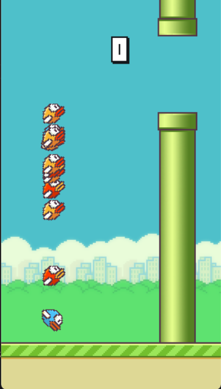
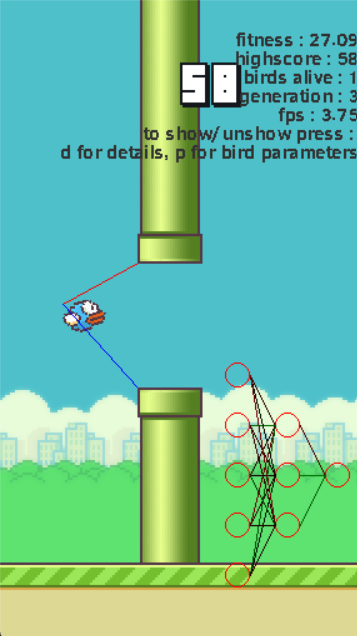

# Flappy Bird AI Project (2022)


This project involves creating an AI that learns to play Flappy Bird using a neural network with a simple architecture. The game is coded from scratch, and the sprites are taken from the original Flappy Bird game.

## Overview

The AI is based on a small neural network consisting of 3 neurons. These neural networks are also implemented from scratch. The learning process utilizes a genetic algorithm for selection. Each generation of birds is created, and the weights of the network from the bird that performs the best are used to construct the next generation. Small mutations (variations) are applied to these weights to introduce diversity.

## Getting Started

To launch the program, follow these steps:

1. Clone the repository to your local machine.
2. Navigate to the root of the repository.
3. Install the required libraries by running:

```bash
pip install -r requirements.txt
```


4. Launch the program by running:

```bash
python main.py
```


## Usage

Upon launching the program, you will be presented with a menu. You have two options:

- Play the game manually by selecting `AI: False` using the arrow keys.
- Observe the AI training by selecting `AI: True` on the menu.

### Controls

If you choose to watch the AI training, you can interact with the program using the following controls:

- Press "d" to view training details.
- Press "p" to display the distances of the birds to the pipes.
- Use arrow keys to manage the speed of the training.

## Project Structure

The main code is located in the `/src` package, while resources essential to the program can be found in the `/resources` package.

## Screenshots

<p align="center">
	
</p>

<p align="center">
	
</p>

## Credits

This project was developed by Guillaume DI FATTA. Feel free report issues, or provide feedback.
